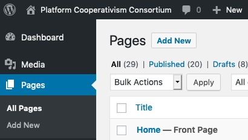
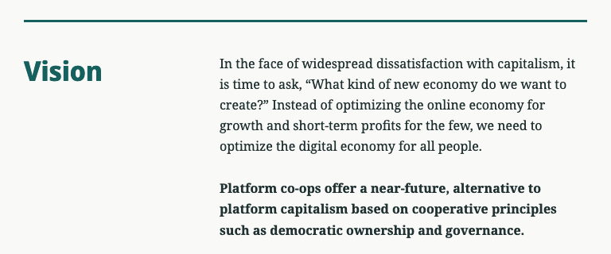

# Content Management

## Pages

Pages form the basic structure of platform.coop. They can be edited under the **Pages** menu on the WordPress Dashboard.

When editing a page, you can use blocks to create the basic page structure. The default layout for platform.coop uses two columns, with subheadings in the left column and content in the right column:

When editing your page, you can create this two-column layout by inserting a Columns block, then inserting a level two heading in the left column and the section's content in the right column:

## Events

TODO.

## People

TODO.

## Images & Media

TODO.
